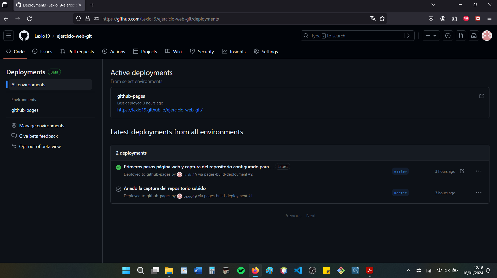
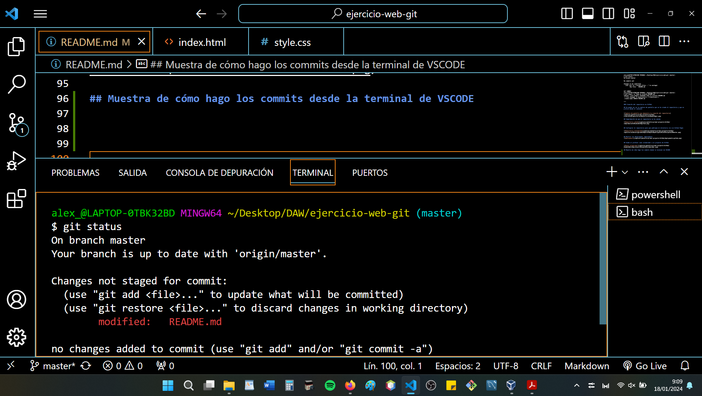
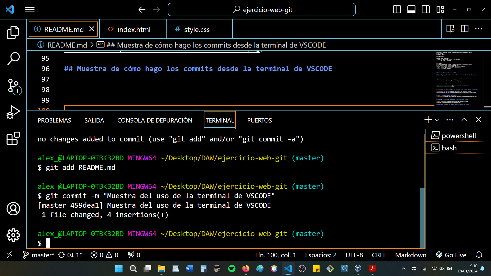
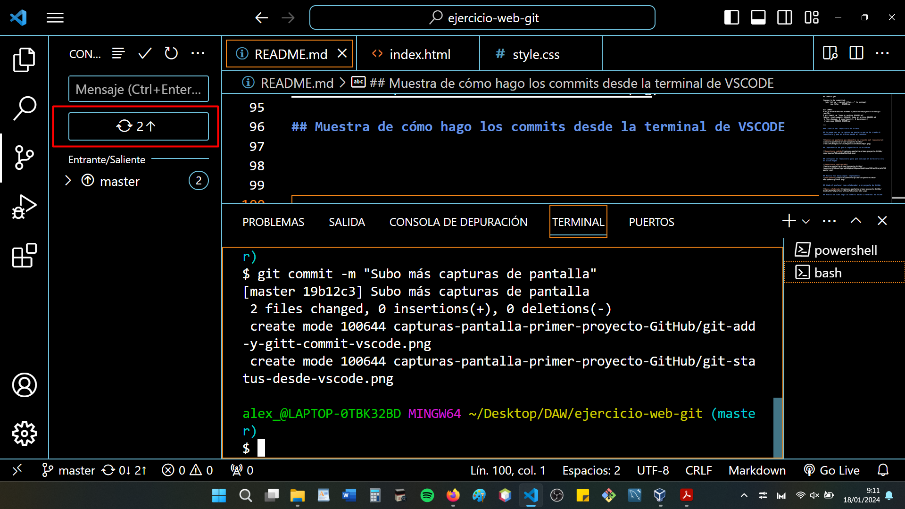

## DOCUMENTACIÓN DEL PRIMER PROYECTO GIT Y GITHUB

### NOMBRE Y APELLIDOS DEL ALUMNO
Alejandro Miras Andújar

### NOMBRE DEL MÓDULO
LENGUAJE DE MARCAS Y SISTEMAS DE GESTIÓN DE LA INFORMACIÓN

### NOMBRE DEL INSTITUTO
IES AGUADULCE

### CURSO ESCOLAR
1º DAW

### Creación del repositorio en nuestro ordenador

~~~
alex_@LAPTOP-0TBK32BD MINGW64 ~/Desktop/DAW
$ mkdir ejercicio-web-git

alex_@LAPTOP-0TBK32BD MINGW64 ~/Desktop/DAW
$ git init ejercicio-web-git/
Initialized empty Git repository in C:/Users/alex_/Desktop/DAW/ejercicio-web-git/.git/

alex_@LAPTOP-0TBK32BD MINGW64 ~/Desktop/DAW
$ cd ejercicio-web-git/

alex_@LAPTOP-0TBK32BD MINGW64 ~/Desktop/DAW/ejercicio-web-git (master)
$

~~~

### Creación del commit inicial 
~~~
alex_@LAPTOP-0TBK32BD MINGW64 ~/Desktop/DAW/ejercicio-web-git (master)
$ git status
On branch master

No commits yet

Untracked files:
  (use "git add <file>..." to include in what will be committed)
        README.md

nothing added to commit but untracked files present (use "git add" to track)

GIT ADD
alex_@LAPTOP-0TBK32BD MINGW64 ~/Desktop/DAW/ejercicio-web-git (master)
$ git add README.md

alex_@LAPTOP-0TBK32BD MINGW64 ~/Desktop/DAW/ejercicio-web-git (master)
$ git status
On branch master

No commits yet

Changes to be committed:
  (use "git rm --cached <file>..." to unstage)
        new file:   README.md

GIT COMMIT
alex_@LAPTOP-0TBK32BD MINGW64 ~/Desktop/DAW/ejercicio-web-git (master)
$ git commit -m "Subo el archivo README.md"
[master (root-commit) 632e648] Subo el archivo README.md
 1 file changed, 0 insertions(+), 0 deletions(-)
 create mode 100644 README.md

~~~

### Creación del repositorio en GitHub

## Se puede ver en la captura de pantalla que se ha creado el repositorio y que es público desde el comienzo

## Comprobación de que el repositorio se ha subido

## Configurar el repositorio para que publique el directorio raíz en Github Pages

## Mostrar los despliegues `deployments`

## Añado al profesor como colaborador a mi proyecto de GitHub

## Muestra de cómo hago los commits desde la terminal de VSCODE

## Git Status desde VSCODE

## Git add y git commit desde la terminal VSCODE

## Git push desde VSCODE

