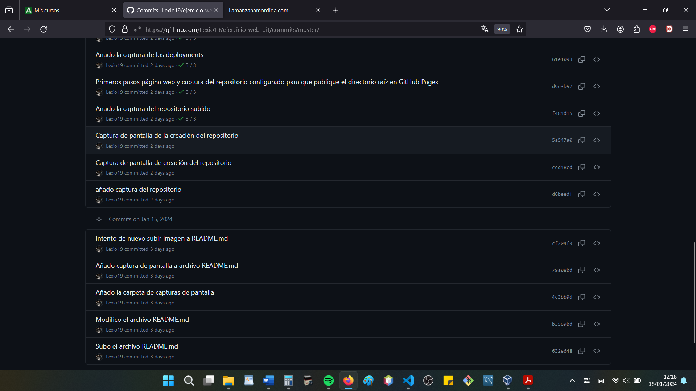

## DOCUMENTACIÓN DEL PRIMER PROYECTO GIT Y GITHUB

### NOMBRE Y APELLIDOS DEL ALUMNO
Alejandro Miras Andújar

### Enlace a mi primera página web
[La manzana mordida](https://lexio19.github.io/ejercicio-web-git/)

### NOMBRE DEL MÓDULO
LENGUAJE DE MARCAS Y SISTEMAS DE GESTIÓN DE LA INFORMACIÓN

### NOMBRE DEL INSTITUTO
IES AGUADULCE

### CURSO ESCOLAR
1º DAW

### Creación del repositorio en nuestro ordenador. Consiste en crear la carpeta con mkdir e iniciarla como un repositorio de git con el comando git init en la terminal Git Bash

~~~
alex_@LAPTOP-0TBK32BD MINGW64 ~/Desktop/DAW
$ mkdir ejercicio-web-git

alex_@LAPTOP-0TBK32BD MINGW64 ~/Desktop/DAW
$ git init ejercicio-web-git/
Initialized empty Git repository in C:/Users/alex_/Desktop/DAW/ejercicio-web-git/.git/

alex_@LAPTOP-0TBK32BD MINGW64 ~/Desktop/DAW
$ cd ejercicio-web-git/

alex_@LAPTOP-0TBK32BD MINGW64 ~/Desktop/DAW/ejercicio-web-git (master)
$

~~~

### Creación del commit inicial. Un commit es una instantánea de tu trabajo que se guarda en el repositorio local hasta que lo decidas subir a GitHub. Nuestro primer commit es el archivo README.md, que es la documentación del proyecto.
~~~
alex_@LAPTOP-0TBK32BD MINGW64 ~/Desktop/DAW/ejercicio-web-git (master)
$ git status
On branch master

No commits yet

Untracked files:
  (use "git add <file>..." to include in what will be committed)
        README.md

nothing added to commit but untracked files present (use "git add" to track)

GIT ADD
alex_@LAPTOP-0TBK32BD MINGW64 ~/Desktop/DAW/ejercicio-web-git (master)
$ git add README.md

alex_@LAPTOP-0TBK32BD MINGW64 ~/Desktop/DAW/ejercicio-web-git (master)
$ git status
On branch master

No commits yet

Changes to be committed:
  (use "git rm --cached <file>..." to unstage)
        new file:   README.md

GIT COMMIT
alex_@LAPTOP-0TBK32BD MINGW64 ~/Desktop/DAW/ejercicio-web-git (master)
$ git commit -m "Subo el archivo README.md"
[master (root-commit) 632e648] Subo el archivo README.md
 1 file changed, 0 insertions(+), 0 deletions(-)
 create mode 100644 README.md

~~~

### Creación del repositorio en GitHub
## De esta forma creamos el lugar donde se va a hospedar nuestro proyecto en la misma página de GitHub

## Se puede ver en la captura de pantalla que se ha creado el repositorio y que es público desde el comienzo

## Comprobación de que el repositorio se ha subido. Cuando creas el repositorio en GitHub, te da una serie de instrucciones que debes escribir en tu terminal para subir la carpeta git que has creado en tu equipo local. Cuando las escribes, tu repositorio se sube a GitHub y todos los cambios que hagas podrás guardarlos en esta web

## Configurar el repositorio para que publique el directorio raíz en Github Pages

## Mostrar los despliegues `deployments`. Los `deployments` muestran el progreso de tu proyecto

## Añado al profesor como colaborador a mi proyecto de GitHub

## Muestra de cómo hago los commits desde la terminal de VSCODE. Hay dos formas de hacerlo, desde la misma terminal de git bash o con esta terminal integrada en Visual Studio Code. Aquí se muestra cómo se hace desde la segunda, puesto que es más fácil e intuitivo.

## Git Status desde VSCODE

## Git add y git commit desde la terminal VSCODE

## Git push desde VSCODE

## Captura de pantalla de la cabecera de la página web

## Captura que demuestra que el enlace de la página está en el README.md

## Repositorio subido a mi GitHub

## Capturas de todos los commit que he hecho del trabajo

